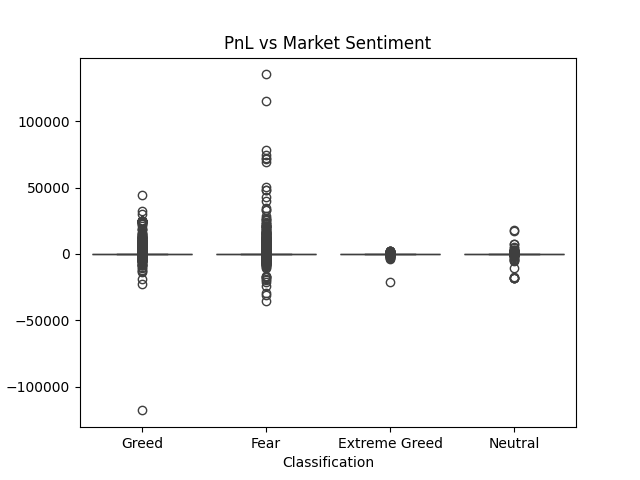

# Trader Performance vs Market Sentiment Analysis

## Overview

This project analyzes the relationship between Bitcoin market sentiment (Fear/Greed Index) and trader behavior on Hyperliquid.

The objective is to understand how trader performance and behavior change during Fear and Greed periods.

---

## Datasets

1. Bitcoin Fear & Greed Index
2. Hyperliquid Historical Trader Data

---

## Project Structure

trader-sentiment-analysis
│
├── data
├── notebooks
├── outputs
├── src
├── README.md
├── insights.md
└── requirements.txt

---

## Key Analysis

• Trader PnL vs Market Sentiment  
• Trade frequency patterns  
• Long vs Short behavior  
• Trader segmentation using clustering  

---

## Example Visualization

### PnL vs Market Sentiment

---

## Key Insights

1. Trader PnL volatility increases during Fear sentiment periods.

2. Traders tend to increase trade sizes during Greed periods.

3. Clustering reveals distinct trader behavior patterns.

---

## Strategy Recommendations

• Reduce position size during Fear periods.

• Avoid overtrading during Greed sentiment.

• Segment traders for customized strategies.

---

## How to Run

Install dependencies:

pip install -r requirements.txt

Run analysis:

jupyter notebook notebooks/analysis.ipynb